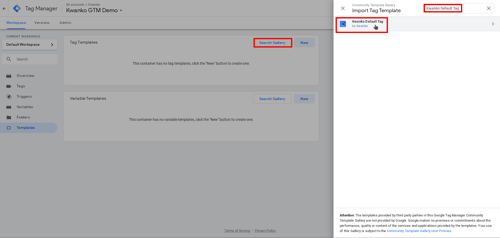
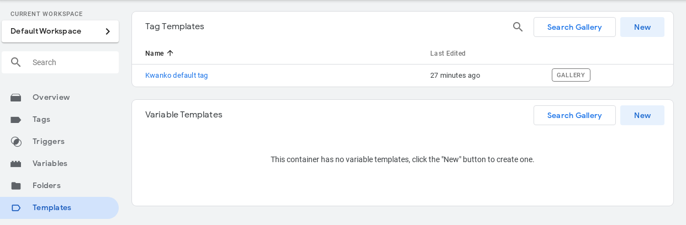

# Kwanko Default Tag for GTM setup guide

In this documentation, you'll find the detailed steps to easily setup the Kwanko Default Tag for GTM.

## Introduction

### What is it for ?

This tag goal is to make you compliant with our third party cookieless tracking feature called uniJS if you've not already installed it on your website.
It helps storing and sending the Kwanko click identifier usefull for the Kwanko tracking.

### When should I install it ?

As mentionned before, this tag might be usefull **only if you've NOT installed** our uniJS tracking library on your website, as uniJS library already handle that part. So if you don't have, it is optimal to install it in addition to our Kwanko universal conversion tag for GTM to guarantee better tracking results.

### What does it do ?

This tag does not fire any conversion or tracking events over Kwanko.
It is watching over incoming Kwanko **kwkuniv** param added by Kwanko in click links redirected to your website.
The value of this param will then be stored in a first party cookie called **kwku** and it's value automatically forwarded when a Kwanko conversion tag is fired on your website.
So this tag should be setup and triggered on all your website pages on page view to ensure optimal tracking.

## Setup steps

### Custom variable setup

First, you'll have to setup a specific custom JavaScript variable required in our template. This variable will dynamically generate an expiration date based on current date.

To add this variable, please refer to the **Variables > New** action in your GTM interface :


Then choose the Custom JavaScript variable type :


And paste the following JavaScript code snippet in the textarea field :
```
 function() {
   var cdate = new Date();
   cdate.setTime(cdate.getTime() + (60*24*60*60*1000));
   return cdate.toUTCString();
 }
```


And save the variable with an appropriate name (ex: `expirationDate`).

### Search and add Kwanko template from the gallery

The first step is to add the Kwanko default tag template from the template gallery to your workspace.
In the "templates" tab, click on "Search Gallery" button and search for "Kwanko default tag" in the search bar.


Follow the steps to add the template through the "Add to workspace" and "Add" button in the confirmation box.
From there, the imported template will be displayed in you workspace with the "gallery" flag.


### Create a new tag

Next step is to create a new Tag in your GTM workspace :


### Tag configuration

Then you will have to configure your tag :


And searching for the Kwanko default GTM template :


Then you'll be asked to setup the expiration date variable.
You'll have to match it with the custom JavaScript variable you have setup previously.


### Choose your custom trigger

Don't forget to associate a trigger rule that might be "All pages" for this tag (as it should be fired on each page of your website to be able to watch for incoming Kwanko tracking parameters) :


### Save, submit and publish your container

And that's it !
Congratulations, your Kwanko Default Tag is ready to be used.
